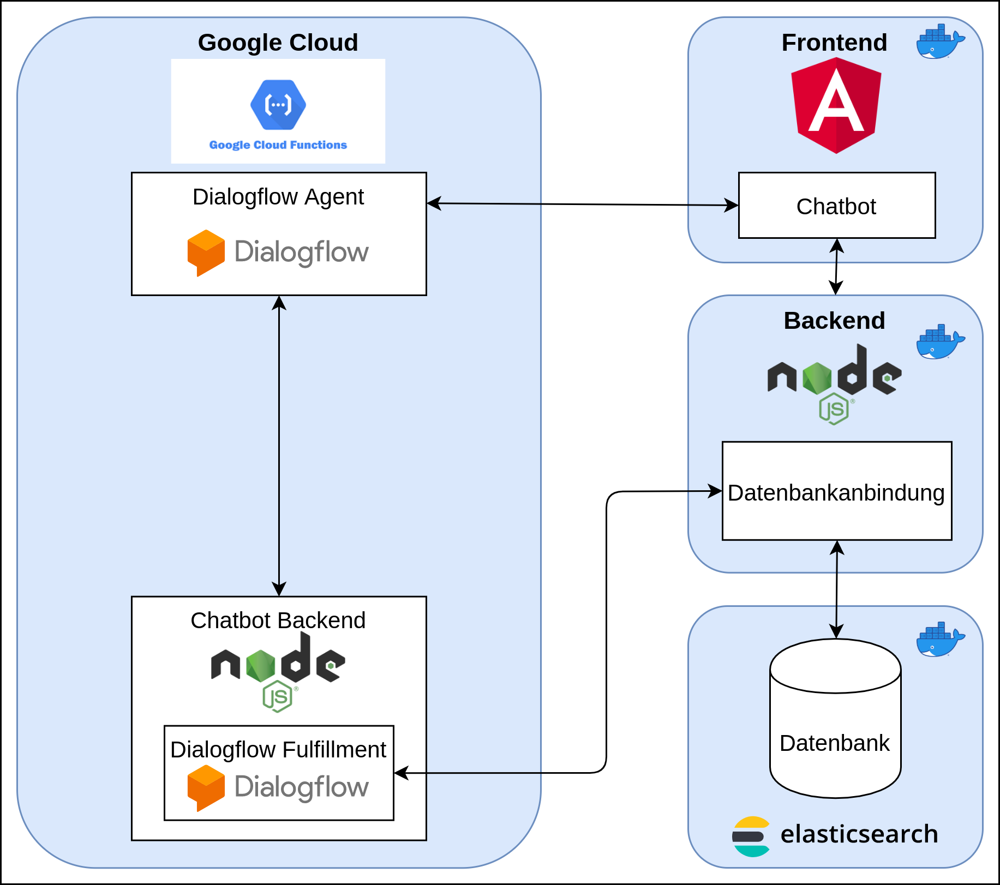

# Localhorst Backend


## About

This repository contains the source code for the backend application of _Support for Localho(r)st_.

_Support for Localho(r)st_ was initiated during the hackathon [#WirVsVirus](https://www.bundesregierung.de/breg-de/themen/coronavirus/wir-vs-virus-1731968) that was initiated by the German government and took place between March 20 and March 22, 2020. You can read more about our idea in our [Devpost project](https://devpost.com/software/1_016_a_lokale_unternehmen_support_your_localho-r-st).

You can access a live demo of our project at [https://support-for-localhorst.philenius.de](http://support-for-localhorst.philenius.de/). The backend is deployed at [https://support-for-localhorst.philenius.de/api/recommendations](https://support-for-localhorst.philenius.de/api/recommendations).

This backend application provides access to our data that is stored in [Elasticsearch](https://www.elastic.co/elasticsearch/). We use Elasticsearch's full-text search and result scoring to display filtered results in our frontend. The backend implementation is based on [NodeJS](https://nodejs.org/en/) and uses the [official Node.js client for Elasticsearch](https://github.com/elastic/elasticsearch-js). The resulting app is dockerized so that it can run everywhere respectively on every cloud. The latest build in form of a Docker image is hosted on [Docker Hub](https://hub.docker.com/repository/docker/supportforlocalhorst/localhorst-backend).



## Development

1. Start a local Elasticsearch instance:
   ```bash
   docker run -p 9200:9200 -e "discovery.type=single-node" --name elasticsearch --rm docker.elastic.co/elasticsearch/elasticsearch:7.6.1
   ```
   You can access Elasticsearch at [http://localhost:9200](http://localhost:9200).

2. Optional: start a Kibana instance:
   ```bash
   docker run --link elasticsearch:elasticsearch -p 5601:5601 --rm kibana:7.6.1
   ```
   You can access Kibana at [http://localhost:5601](http://localhost:5601). Kibana provides a graphical UI for Elasticsearch.

3. Start the NodeJS backend application:
   ```bash
   cd localhorst/
   npm install
   ELASTICSEARCH_NODE="http://localhost:9200" DEBUG=localhorst:* npm start
   ```

4. You can access the API of the backend application using curl or your browser:

   ```bash
   # get all recommendations
   curl "http://localhost:3000/recommendations"
   
   # get filtered recommendations
   curl "http://localhost:3000/recommendations?type=info&industry=retail&text=kredit&category=financial"
   ```

## Build

```bash
docker build -t supportforlocalhorst/localhorst-backend .
docker push supportforlocalhorst/localhorst-backend
```

## Full Deployment of _Support For Localho(r)st_ Project

For deployment we use Docker Compose. We provide two different Docker Compose configuration files.

1. `docker-compose-local-deployment.yml` for **local deployment**, e.g. for demo/testing purposes. Direct access to all applications is allowed.
2. `docker-compose.yml` for deployment on a **remote deployment**, e.g. on a server. Direct access to all applications is prohibited.

These configuration files define the deployment of our frontend, backend, and database. In addition, the Docker Compose configuration includes an NGINX reverse proxy which serves both applications, backend and frontend, at a unified endpoint on port 8080. You can access the Angular frontend single page application at [http://localhost:8080](http://localhost:8080). The NodeJS backend application runs at [http://localhost:8080/api/recommendations](http://localhost:8080/api/recommendations).

### Local Deployment

You can use our _Docker Compose_ file `docker-compose-local-deployment.yml` for starting the whole application stack **locally**:

```bash
docker-compose -f docker-compose-local-deployment.yml up
```

With this configuration, you can bypass NGINX to access all applications directly: [http://localhost:8081](http://localhost:8081) (frontend) and [http://localhost:8082](http://localhost:8082) (backend). The Elasticsearch instance can be reached at [http://localhost:9200](http://localhost:9200).

### Remote Deployment

You can use our _Docker Compose_ file `docker-compose.yml` for starting the whole application stack on a **remote server**:

```bash
docker-compose -f docker-compose.yml up
```

With this configuration, direct access (=bypassing the NGINX) to frontend, backend, and Elasticsearch is prohibited. All services are hidden behind the NGINX.

## Related Repositories

- [localhorst-frontend](https://github.com/Social-Developers-Club/localhorst-frontend)
- [localhorst-chatbot-backend](https://github.com/Social-Developers-Club/localhorst-chatbot-backend)
